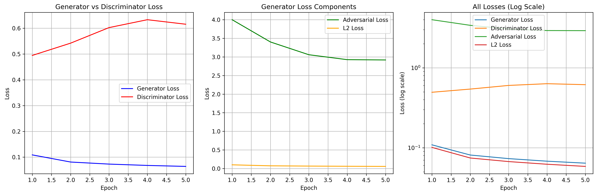

# Context Encoder — Semantic Face Inpainting

A deep learning model that fills in missing regions of face images using a GAN-based context encoder.

## What it does
Given a face image with the center removed, the model predicts and fills in the missing pixels.

## Model Architecture
- **Generator**: Encoder-Decoder CNN (context encoder)
- **Discriminator**: Local patch discriminator
- **Dataset**: CelebA (200,000+ face images)
- **Framework**: PyTorch

## Training
- 5 epochs on Google Colab (T4 GPU)
- Combined L2 loss + adversarial loss

## Loss Curves

## How to Run
Open `main copy(1).ipynb` in Google Colab and run all cells.
